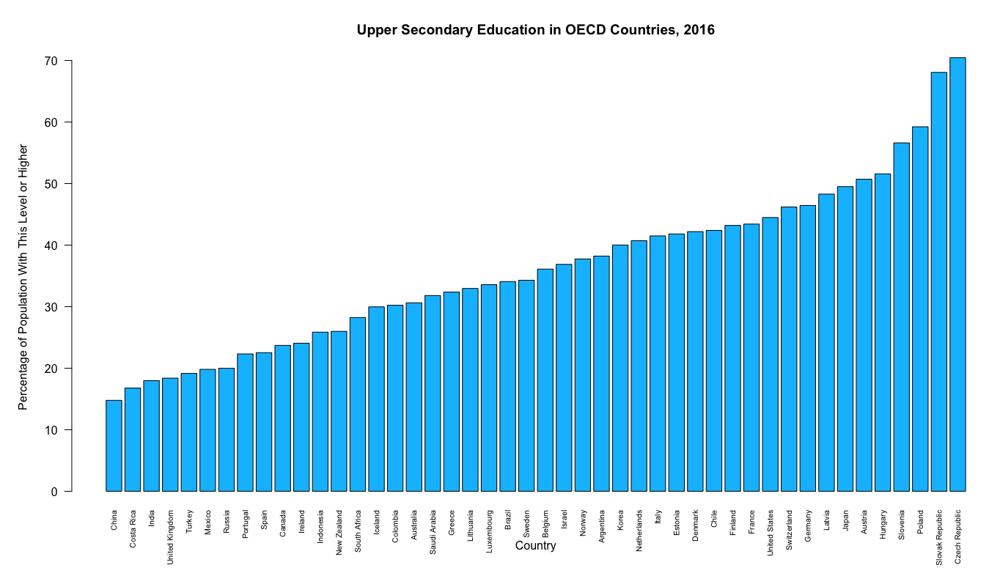

# Introduction

For my first statistics homework assingment, I was told to make a visualization of an aribitrary dataset. I decided to practice my R skills (not covered in class) to produce this visualization.

# The Dataset

I have already cleaned up the dataset for this project and have kept only the columns that are relevant.

```{r}
  load("oecd.Rdata")
  head(edu, 5)
```

Let's remove the rows we don't need, like the G20 and EU entries.

```{r}
  edu_noagg <- subset(edu, (Country != 'G20' & Country != 'European Union 22 members in OECD' & Country != 'OECD - Average'))
  head(edu_noagg, 5)
```

# The Visualization

```{r include=FALSE}
barplot(edu_noagg$Value, names.arg=edu_noagg$Country, las=2, cex.names=0.6, xlab = 'Country', ylab = 'Percentage of Population', main = 'Upper Secondary Education in OECD Countries')
```

This produces a bar chart like this one (some display settings adjusted for aesthetic reasons):



Based on this plot, we can see that China has the lowest rate of secondary school completion while the Czech Republic has the highest rate.

# Conclusion

This assignment allowed me to practice my R data manipulation and analysis skills. I learned how to use R's `DataFrame` type, how to remove columns and manipulate rows in the `DataFrame`, how to import data and export data for later use, and also how to visualize the data using R's plots. 
